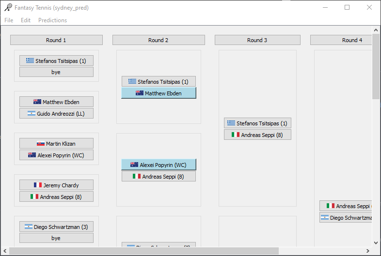

<!-- page_number: true -->
<style scoped>section{background-color:#fff8e1; color:#455a64}, h1{color:#455a64}</style>


# Fantasy Tennis

* A viewer for ATP tennis brackets (github.com/nathanesau/FantasyTennis)
* Allows user to make predictions and view future matchups
* Allows user to save predictions for later use
* Allows user to download bracket data from ATP website

---


---
# Technology Stack

* Programming language: Python
* GUI framework: PyQt5
* IDE: Visual Studio Code

---
# Specification

* Download HTML bracket
* Convert HTML bracket to Sqlite3
* Load Sqlite3 bracket
* Click on player name to make prediction
* Click on round to hide/ show round
* Save predictions
* Load predictions

---
# Inspiration

* Competitive smash double elimination brackets
* Wanted to see who would play who in future rounds
* For large brackets, it is difficult to figure this out

---


---
# Implementation

Discuss how application was created:

1. Web scraping with ``BeautifulSoup``
2. Database code
3. Widget classes
4. Predictions logic

---
# Web scraping

Simplified HTML code for US open bracket.

```html
<div class="scores-draw-entry-box">
    <table class="scores-draw-entry-box-table">
        <tbody>
            <tr>
                <td>1</td> <!--playerID-->
                <td><span>(1)</span></td> <!--seed-->
                <td><a href="/en/players/novak-djokovic/d643/overview"></td>
            </tr>
        </tbody>
    </table>
</div>
```

---
Simplified snipped to parse the HTML tags (``html_to_db`` function):

```python
# output: seed, country, name

for box in soup.find_all('div', {'class': 'scores-draw-entry-box'}):
    table_tags = box.find_all('table')
        if len(table_tags): # round 1
            tr_tags = box.find_all('tr')
            for tr_tag in tr_tags:
                span_tags = tr.tag.find_all('span')
                seed = '' if not len(span_tags) else span_tags[0]
                a_tags = tr_tag.find_all('a')
                name = 'bye' if not len(a_tags) else a_tags[0]['data-ga-label']
                img_tags = tr_tag.find_all('img')
                country = '' if not len(img_tags) else img_tags[0]['src']
        else: # round 2, ...
            a_tags = box.find_all('a'):
            name = 'unknown' if not len(a_tags) else a_tags[0]['data-ga-label']
```

---
Comments on webscraping:

* Possibility of webscraping code being broken if website to scrape from is changed (i.e. tags are changed).

* I am maintaining an archive of the data [FantasyTennisData](https://github.com/nathanesau/FantasyTennisData) should this happen (at least past tournaments will be available)

---
# Database

* Draw table
    * Player matchups (top of bracket to bottom)
    * Round, Player1, Player2
* Player table
    * Player information (name is common to draw table and player table)
    * Player, Seed, Country

---

*Draw table*


*Player table*


---
Simplified database code snippet (``TennisDatabase`` class):

```python
def createTableDraw(self):
    q = QSqlQuery("CREATE TABLE DRAW (id INTEGER PRIMARY KEY, Round INTEGER, " +
                  "Player1 TEXT, Player2 TEXT)")
    q.isActive() # qWarning if failed

def populateTableDraw(self, drawRowList):
    q = QSqlQuery()
    q.prepare("INSERT INTO Draw(Round, Player1, Player2) VALUES(?,?,?)")
    QSqlDatabase.database().transaction()
    for r in drawRowList:
        q.bindValue(0, r[0]), q.bindValue(1, r[1]), q.bindValue(2, r[2])
        q.exec() # qWarning if failed
    QSqlDatabase.commit()

def loadTableDraw(self, drawRowList):
    q = QSqlQuery()
    q.exec("SELECT Round, Player1, Player2 FROM Draw") # qWarning if failed
    while q.next():
        roundNum, player1, player2 = q.value(0), q.value(1), q.value(2)
        drawRowList.append([roundNum, player1, player2])
```

---
# Interface

* Develop interface intuition, i.e. when looking at a software program be able to recogize what widgets are used, what layouts are used, etc.
* For FantasyTennis, ``MainWindow`` contains a ``QScrollArea``
    * The ``QScrollArea`` uses a central ``Bracket`` widget 
    * The ``Bracket`` widgets is a ``QHBoxLayout`` of ``RoundBracket`` widgets
    * Each ``RoundBracket`` is a ``QVBoxLayout`` of ``BracketNode`` widgets
    * Each ``BracketNode`` is a ``GroupBox``with a ``QVBoxLayout`` of ``PlayerNode`` widgets
    * Each ``PlayerNode`` is a ``QPushButton`` (contains the data)
    
---


---
Simplified code from ``Bracket`` class:

```python
class Bracket(QWidget):
    def __init__(self, roundBrackets):
        self.roundBrackets = roundBrackets # used to access data later
        self.mainLayout = QHBoxLayout()
        self.mainLayout.setSpacing(0)
        for roundNum in range(0, len(self.roundBrackets, 1), 1):
            self.mainLayout.addWidget(self.roundBrackets[roundNum])
        self.mainLayout.setSizeConstraint(QLayout.SetMinimumSize)
        self.setLayout(self.mainLayout)
```

Note:

* Using size constraints like this ensures all player names fit in the widgets
* Using layouts is recommended, since they automatically scale

---
# Loading Bracket

* Provided that we have the database with the information shown before, we want to be able to view the database information in a user-friendly format
* Code to create the interface objects from the database is shown in next few slides

---
Simplified code snippet to load a bracket:

```python
def getNodes(tennisData):
    nodes = {}, sdict = {}, cdict = {}
    for row in tennisData.playerRowList: # parse playerRowList
        player, seed, country = row[0], row[1], row[2]
        sdict[player] = seed, cdict[player] = country
    round1Rows = []
    for row in tennisData.drawRowList: # parse drawRowList
        (round1Rows.append(row) if row[0] is 1 else None)
    drawSize = len(round1Rows)
    numRounds = int(math.log(drawSize)/math.log(2)) + 1
    for row in tennisData.drawRowList:
        rn = row[0] # 1, 2, ...
        p = [row[1], row[2]]
        if rn <= numRounds:
            s = ['0' if not e in sdict else sdict[e] for e in p]
            c = ['' if not e in cdict else cdict[e] for e in p]
            d = [PlayerNodeData(p[i], s[i], c[i]) for i in range(2)]
            nd = BracketNodeData(d[0], d[1])
            nodes[rn] = [] if not rn in nodes else nodes[rn] + [BracketNode(nd, rn)]
    return nodes
```

--- 
Simplified code snippet to load a bracket (continued):

```python
class MainWindow:
    def showData(self, tennisData):
        nodes = getNodes(tennisData) # previous slide

        roundBrackets = []
        for key in nodes.keys():
            roundBrackets.append(RoundBracket(nodes[key], key))

        self.bracket = Bracket(roundBrackets)
        self.scrollArea.setWidget(self.bracket)
```

---
# Predictions

* When ``PlayerNode`` clicked, call ``MainWindow.update`` function
* In ``MainWindow.update`` determine which ``PlayerNode`` objects are affected
* For each affected node, call ``PlayerNode.update``

---
Simplified code from ``PlayerNode`` class:

```python
class PlayerNode(QWidget):
    clicked = pyqtSignal()

    def __init__(self, data, parent=None):
        super().__init__(parent)
        self.button = QPushButton()
        self.button.clicked.connect(self.clicked.emit)
        self.mainLayout = QHBoxLayout()
        self.mainLayout.addWidget(self.mainLayout)
        self.setLayout(self.mainLayout)
        self.origData = data
        self.update(data) # self.data

    def update(self, data):
        self.button.setIcon(QIcon(":" + data.country))
        self.button.setText(data.name + "(" + str(data.seed) + ")")
        s = "background-color:lightblue" if data.name != self.origData.name else ""
        self.setStyleSheet(s)
        self.data = data
```

---
Simplified code from ``BracketNode`` class:

```python
class BracketNode(QWidget):
    def __init__(self, data, roundNum): # mainWindow reference not shown
        self.roundNum = roundNum
        self.p1Node = PlayerNode(data.playerOneNodeData)
        self.p1Node.clicked.connect(self.onNode1Clicked)
        self.p2Node = PlayerNode(data.playerTwoNodeData)
        self.p2Node.clicked.connect(self.onNode2Clicked)
        self.groupBoxLayout = QVBoxLayout()
        self.groupBoxLayout.addWidget(self.p1Node)
        self.groupBoxLayout.addWidget(self.p2Node)
        self.groupBox = QGroupBox()
        self.groupBox.setLayout(self.groupBoxLayout)
        self.mainLayout = QVBoxLayout()
        self.mainLayout.addWidget(self.groupBox)
        self.setLayout(self.mainLayout)
    
    def onNode1Clicked(self):
        self.mainWindow.updateBracket(self.p1Node.data, self.p2Node.data, self.roundNum)

    def onNode2Clicked(self):
        self.mainWindow.updateBracket(self.p2Node.data, self.p1Node.data, self.roundNum)
```

---
Simplified code from ``MainWindow`` class:

```python
class MainWindow(QMainWindow):
    def getIndexDict(self, winner, loser, currRN): # indices affected each round
        indexDict = {}
        cbracket = self.bracket.roundBrackets[currRN-1] # 0-indexed
        for i in range(len(cbracket.bracketNodes)): # bracketNodes for round
            d1, d2 = BracketNodeData(winner, loser), BracketNodeData(loser, winner)
            if cbracket.bracketNodes[i].data is d1 or cbracket.bracketNodes[i].data is d2:
                indexDict[currRN] = [i+1]
                break
        for rn in range(currRN+1, len(self.bracket.roundBrackets)+1, 1)
            x = indexDict[rn-1]
            y = x + 1 if x % 2 else x
            indexDict[rn] = int(y/2) # click affects all future rounds
        return indexDict
```

---
Simplified code from ``MainWindow`` class (continued):

```python
class MainWindow(QMainWindow):
    def updateBracket(self, winner, loser, currRN):
        indexDict = getIndexDict(winner, loser, currRN)
        for rn in range(currRN+1, len(self.bracket.roundBrackets)+1, 1):
            prev_index, index = indexDict[rn-1], indexDict[rn]
            top = prev_index % 2 # true if winner is at top of bracket node
            roundBracket = self.bracket.roundBrackets[rn-1]
            bracketNode = roundBracket
            playerNode = bracketNode.p1Node if top else bracketNode.p2Node
            pname, wname, lname = playerNode.data.name, winner.name, loser.name
            if pname != wname: 
                if pname is lname or (pname is "unknown" and rn is currRN + 1):
                    # update bracket node info
                    playerNode.update(winner)
        
        self.bracket.repaint()
```

---
# Closing implementation remarks

* Predictions are saved same way as ``Draw`` (three columns, ``Round``, ``Player1`` and ``Player2``) but to a different table.
* The program allows the user to specify directory for ``html_data``, ``data`` and ``predictions`` (preferences). You can use ``QSettings`` for this sort of thing.
* Clicking on ``Round 1``, ``Round 2``, etc. buttons hides the ``RoundBracket`` (each time the button is pressed, the ``Bracket`` must be re-created (more complexity, not shown)
* This project is about 1000 lines of python code. I have split the code into roughly 10 python files (one file per class roughly).

---
# Future improvements to this project

* The title of each ``BracketNode`` could contain information about the match (requires more HTML parsing).
* Double elimination brackets could be implemented for Smash style bracket (the reason I didn't do this yet, is because ``Smash.gg`` website is difficult to parse data from).
